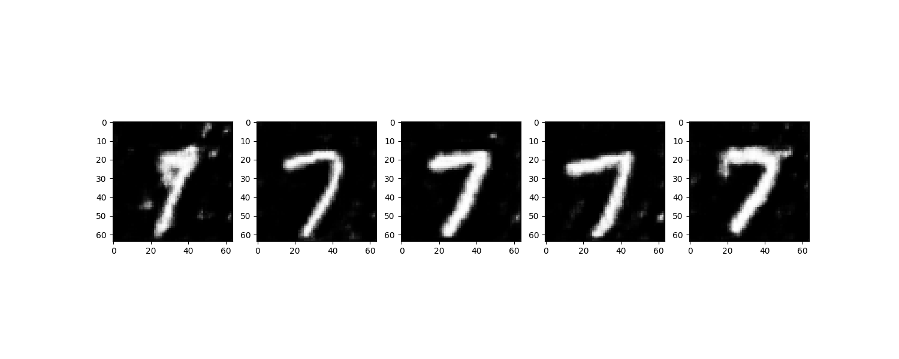

# What's this?
DCGAN（Deep Convolution Generative Adversarial Network）のPyTorchによる実装。
MNISTデータを用い、手書き文字の生成を行っています。

# 結果
7と8の画像を用い生成を行った。7のほうが騙すのが簡単なため、7の画像のみ生成されるモード崩壊が起きていることがわかる。

# GANとは？
- Generator（生成器）
- Discriminator（識別器）

の2つからなるNN系の生成モデル。
偽札を作る人、警察とそれぞれ擬えられることが多い。

## Generatorってなんなのさ
- 考えられるすべての画像パターンのうち、人間が見て○○だ！と思える画像パターンを生成する
- 同じ画像を生成してしまうのはよくないので、入力として乱数とる
- 教師データとして、「○○に見える画像」を取る。そこから、○○の特徴を捉えていくことで生成

キーとなるユニットとして、 転置畳み込み（`nn.ConvTranspose2d()`）がある。
普通の畳込みと逆のような操作を行っている。どちらもカーネルを使い、入力データのセルを見ていく。
カーネル単位で見ていくのが普通の畳込み。セル単位で見ていくのが転置畳込み。

## Discriminatorってなんなのさ
- Generatorができたなら、適切な損失関数を定義することで学習できる
- けど、どんな損失関数を定義したらよいかわからない。
  - 教師データとの誤差を取ると、同じ画像を生成してしまうし……
  - 人が見た時にどれくらい数字に見えるかという情報を基に損失を定義したい
    - 膨大な数の画像をチェックしなきゃいけないから人だとしんどい
    - 最初に生成される画像はそもそも数字に見えない、数字に見えるデータがないと学習が進まない
- じゃあ、そのどれくらい数字に見えるか判定するのもモデルにやらせよう、というのがDiscriminator

っていうことで、普通の画像分類モデルと大きく変わらないけど、キーとなるのがLeakyReLUの利用。
識別器から生成器まで誤差を伝播させたいというモチベーション（気持ち）
背景の理論的な部分もちょっとかじってみたい（願望）

## 損失関数
まず、識別器は「生成器が生成した画像か、本物の画像かを見極める」ように損失関数を設定。
つまり、普通の2値分類タスクで用いられるBinary Cross Entropy Lossを用いればよい。

\[ -\sum^M_{i=1} [l_i \log y_i + (1 - l_i) \log (1 - y_i)] \]

続いて、生成器は識別器を騙すようにする、つまり識別器の損失関数を最大化するように

\[ \sum^M_{i=1} [l_i \log y_i + (1 - l_i) \log (1 - y_i)] \]

を最小化する。識別器は偽の画像を生成するので、$l_i=0$となるので、

\[ \sum^M_{i=1} \log (1 - y_i) \]

となる。ただし、このままでは学習が進みにくいという問題点がある。
これは、Dが正しく判定されていった場合、つまり$y_i$が0に近づいていった場合、
損失関数が0に近づいてしまうため。
そこで、$y_i$が1と判定してくれるように、

\[ -\sum^M_{i=1} \log (y_i) \]

とする。

# PyTorchの実装面、DCGANの実装上の注意など
- Datasetクラスを継承
  - torch.data.Datasetクラスを継承
  - `__len__`と`__getitem__`を記述（これだけでよい）
- DataLoaderを作成
  - バッチ処理のため
- train部分のコードを記述し学習
  - 先程のDataLoaderを用いる
- パラメータの初期化
  - 転置畳み込み・畳み込み層は、平均0、標準偏差0.02の正規分布
  - BatchNorm部分は平均1、標準偏差0.02の正規分布
  - bias項は0
  - で初期化

# 実装でふわふわしていた部分
- 偽の画像について、DiscriminatorとGeneratorで別のものを用いていたが、それで良い？

### 参考書籍
- 「つくりながら学ぶ! PyTorchによる発展ディープラーニング」（小川雄太郎, マイナビ出版, 2019)
